# 2020.2.24-2020.3.2 学习总结

## 算法优化

在一个深度学习问题中，我们通常会预先定义一个损失函数。有了损失函数以后，我们就可以使用优化算法试图将其最小化。在优化中，这样的损失函数通常被称作优化问题的目标函数（objective function）。在训练网络中就需要关注模型的准确性与泛化性。通过模型定义的目标函数来训练学习到最小化目标函数的近似解，通过优化算法实现。

在进行训练时选择不适的优化方法可能得到的最优解是局部解，当前的存在鞍点也会造成这样的情况；但是通过合适的优化算法能够解决这些问题。

### 梯度下降

绝大多数的网络的训练方法都是通过梯度下降方法学习，这里为了加速训练速度则多使用随机梯度下降。

#### 随机梯度下降

在深度学习里，目标函数通常是训练数据集中有关各个样本的损失函数的平均。设$f_i(\boldsymbol{x})$是有关索引为$i$的训练数据样本的损失函数，$n$是训练数据样本数，$\boldsymbol{x}$是模型的参数向量，那么目标函数定义为

$$f(\boldsymbol{x}) = \frac{1}{n} \sum_{i = 1}^n f_i(\boldsymbol{x}).$$

目标函数在$\boldsymbol{x}$处的梯度计算为

$$\nabla f(\boldsymbol{x}) = \frac{1}{n} \sum_{i = 1}^n \nabla f_i(\boldsymbol{x}).$$

如果使用梯度下降，每次自变量迭代的计算开销为$\mathcal{O}(n)$，它随着$n$线性增长。因此，当训练数据样本数很大时，梯度下降每次迭代的计算开销很高。

随机梯度下降（stochastic gradient descent，SGD）减少了每次迭代的计算开销。在随机梯度下降的每次迭代中，我们随机均匀采样的一个样本索引$i\in\{1,\ldots,n\}$，并计算梯度$\nabla f_i(\boldsymbol{x})$来迭代$\boldsymbol{x}$：

$$\boldsymbol{x} \leftarrow \boldsymbol{x} - \eta \nabla f_i(\boldsymbol{x}).$$

这里$\eta$同样是学习率。可以看到每次迭代的计算开销从梯度下降的$\mathcal{O}(n)$降到了常数$\mathcal{O}(1)$。值得强调的是，随机梯度$\nabla f_i(\boldsymbol{x})$是对梯度$\nabla f(\boldsymbol{x})$的无偏估计：

$$E_i \nabla f_i(\boldsymbol{x}) = \frac{1}{n} \sum_{i = 1}^n \nabla f_i(\boldsymbol{x}) = \nabla f(\boldsymbol{x}).$$

这意味着，平均来说，随机梯度是对梯度的一个良好的估计。

SGD训练起来速度很快，但是它没有充分利用不同样本间可能耦合的信息，则在SGD基础上延展出Mini-Batch SGD每次的gradient decent 使用了小批量的样本。

#### Mini-Batch  SGD

在每一次迭代中，梯度下降使用整个训练数据集来计算梯度，因此它有时也被称为批量梯度下降（batch gradient descent）。而随机梯度下降在每次迭代中只随机采样一个样本来计算梯度。正如我们在前几章中所看到的，我们还可以在每轮迭代中随机均匀采样多个样本来组成一个小批量，然后使用这个小批量来计算梯度。下面就来描述小批量随机梯度下降。


设目标函数$f(\boldsymbol{x}): \mathbb{R}^d \rightarrow \mathbb{R}$。在迭代开始前的时间步设为0。该时间步的自变量记为$\boldsymbol{x}_0\in \mathbb{R}^d$，通常由随机初始化得到。在接下来的每一个时间步$t>0$中，小批量随机梯度下降随机均匀采样一个由训练数据样本索引组成的小批量$\mathcal{B}_t$。我们可以通过重复采样（sampling with replacement）或者不重复采样（sampling without replacement）得到一个小批量中的各个样本。前者允许同一个小批量中出现重复的样本，后者则不允许如此，且更常见。对于这两者间的任一种方式，都可以使用

$$\boldsymbol{g}_t \leftarrow \nabla f_{\mathcal{B}_t}(\boldsymbol{x}_{t-1}) = \frac{1}{|\mathcal{B}|} \sum_{i \in \mathcal{B}_t}\nabla f_i(\boldsymbol{x}_{t-1})$$

来计算时间步$t$的小批量$\mathcal{B}_t$上目标函数位于$\boldsymbol{x}_{t-1}$处的梯度$\boldsymbol{g}_t$。这里$|\mathcal{B}|$代表批量大小，即小批量中样本的个数，是一个超参数。同随机梯度一样，重复采样所得的小批量随机梯度$\boldsymbol{g}_t$也是对梯度$\nabla f(\boldsymbol{x}_{t-1})$的无偏估计。给定学习率$\eta_t$（取正数），小批量随机梯度下降对自变量的迭代如下：

$$\boldsymbol{x}_t \leftarrow \boldsymbol{x}_{t-1} - \eta_t \boldsymbol{g}_t.$$

基于随机采样得到的梯度的方差在迭代过程中无法减小，因此在实际中，（小批量）随机梯度下降的学习率可以在迭代过程中自我衰减，例如$\eta_t=\eta t^\alpha$（通常$\alpha=-1$或者$-0.5$）、$\eta_t = \eta \alpha^t$（如$\alpha=0.95$）或者每迭代若干次后将学习率衰减一次。如此一来，学习率和（小批量）随机梯度乘积的方差会减小。而梯度下降在迭代过程中一直使用目标函数的真实梯度，无须自我衰减学习率。


小批量随机梯度下降中每次迭代的计算开销为$\mathcal{O}(|\mathcal{B}|)$。当批量大小为1时，该算法即为随机梯度下降；当批量大小等于训练数据样本数时，该算法即为梯度下降。当批量较小时，每次迭代中使用的样本少，这会导致并行处理和内存使用效率变低。这使得在计算同样数目样本的情况下比使用更大批量时所花时间更多。当批量较大时，每个小批量梯度里可能含有更多的冗余信息。为了得到较好的解，批量较大时比批量较小时需要计算的样本数目可能更多，例如增大迭代周期数。

### Momentum 

模型训练的基本核心通过gradient 来更新参数，在每次迭代中，梯度下降根据自变量当前位置，沿着当前位置的梯度更新自变量。然而，如果自变量的迭代方向仅仅取决于自变量当前位置，这可能会带来一些问题。在正交方向的gradient是不同的。

Momentum的提出是为了解决梯度下降的上述问题。由于小批量随机梯度下降比梯度下降更为广义，本章后续讨论将沿用[“小批量随机梯度下降”](minibatch-sgd.ipynb)一节中时间步$t$的小批量随机梯度$\boldsymbol{g}_t$的定义。设时间步$t$的自变量为$\boldsymbol{x}_t$，学习率为$\eta_t$。
在时间步$0$，动量法创建速度变量$\boldsymbol{v}_0$，并将其元素初始化成0。在时间步$t>0$，动量法对每次迭代的步骤做如下修改：
$$
\begin{aligned}
\boldsymbol{v}_t &\leftarrow \gamma \boldsymbol{v}_{t-1} + \eta_t \boldsymbol{g}_t, \\
\boldsymbol{x}_t &\leftarrow \boldsymbol{x}_{t-1} - \boldsymbol{v}_t,
\end{aligned}
$$

其中，动量超参数$\gamma$满足$0 \leq \gamma < 1$。当$\gamma=0$时，动量法等价于小批量随机梯度下降。

#### 指数加权移动

为了从数学上理解动量法，让我们先解释一下指数加权移动平均（exponentially weighted moving average）。给定超参数$0 \leq \gamma < 1$，当前时间步$t$的变量$y_t$是上一时间步$t-1$的变量$y_{t-1}$和当前时间步另一变量$x_t$的线性组合：

$$y_t = \gamma y_{t-1} + (1-\gamma) x_t.$$

我们可以对$y_t$展开：

$$
\begin{aligned}
y_t  &= (1-\gamma) x_t + \gamma y_{t-1}\\
         &= (1-\gamma)x_t + (1-\gamma) \cdot \gamma x_{t-1} + \gamma^2y_{t-2}\\
         &= (1-\gamma)x_t + (1-\gamma) \cdot \gamma x_{t-1} + (1-\gamma) \cdot \gamma^2x_{t-2} + \gamma^3y_{t-3}\\
         &\ldots
\end{aligned}
$$

令$n = 1/(1-\gamma)$，那么 $\left(1-1/n\right)^n = \gamma^{1/(1-\gamma)}$。因为

$$ \lim_{n \rightarrow \infty}  \left(1-\frac{1}{n}\right)^n = \exp(-1) \approx 0.3679,$$

所以当$\gamma \rightarrow 1$时，$\gamma^{1/(1-\gamma)}=\exp(-1)$，如$0.95^{20} \approx \exp(-1)$。如果把$\exp(-1)$当作一个比较小的数，我们可以在近似中忽略所有含$\gamma^{1/(1-\gamma)}$和比$\gamma^{1/(1-\gamma)}$更高阶的系数的项。例如，当$\gamma=0.95$时，

$$y_t \approx 0.05 \sum_{i=0}^{19} 0.95^i x_{t-i}.$$

因此，在实际中，我们常常将$y_t$看作是对最近$1/(1-\gamma)$个时间步的$x_t$值的加权平均。例如，当$\gamma = 0.95$时，$y_t$可以被看作对最近20个时间步的$x_t$值的加权平均；当$\gamma = 0.9$时，$y_t$可以看作是对最近10个时间步的$x_t$值的加权平均。而且，离当前时间步$t$越近的$x_t$值获得的权重越大（越接近1）。

#### 总结

Momentum设计的核心思想使用指数加权移动来「平滑」gradient，使其以最优的方向指向converge的点。

### AdaGrad算法

目标函数自变量的每一个元素在相同时间步都使用同一个学习率来自我迭代。举个例子，假设目标函数为$f$，自变量为一个二维向量$[x_1, x_2]^\top$，该向量中每一个元素在迭代时都使用相同的学习率。例如，在学习率为$\eta$的梯度下降中，元素$x_1$和$x_2$都使用相同的学习率$\eta$来自我迭代：

$$
x_1 \leftarrow x_1 - \eta \frac{\partial{f}}{\partial{x_1}}, \quad
x_2 \leftarrow x_2 - \eta \frac{\partial{f}}{\partial{x_2}}.
$$

Momentum中当$x_1$和$x_2$的梯度值有较大差别时，需要选择足够小的学习率使得自变量在梯度值较大的维度上不发散。但这样会导致自变量在梯度值较小的维度上迭代过慢。动量法依赖指数加权移动平均使得自变量的更新方向更加一致，从而降低发散的可能。本节我们介绍AdaGrad算法，它根据自变量在每个维度的梯度值的大小来调整各个维度上的学习率，从而避免统一的学习率难以适应所有维度的问题 。

#### 算法细节

daGrad算法会使用一个小批量随机梯度$\boldsymbol{g}_t$按元素平方的累加变量$\boldsymbol{s}_t$。在时间步0，AdaGrad将$\boldsymbol{s}_0$中每个元素初始化为0。在时间步$t$，首先将小批量随机梯度$\boldsymbol{g}_t$按元素平方后累加到变量$\boldsymbol{s}_t$：

$$\boldsymbol{s}_t \leftarrow \boldsymbol{s}_{t-1} + \boldsymbol{g}_t \odot \boldsymbol{g}_t,$$

其中$\odot$是按元素相乘。接着，我们将目标函数自变量中每个元素的学习率通过按元素运算重新调整一下：

$$\boldsymbol{x}_t \leftarrow \boldsymbol{x}_{t-1} - \frac{\eta}{\sqrt{\boldsymbol{s}_t + \epsilon}} \odot \boldsymbol{g}_t,$$

其中$\eta$是学习率，$\epsilon$是为了维持数值稳定性而添加的常数，如$10^{-6}$。这里开方、除法和乘法的运算都是按元素运算的。这些按元素运算使得目标函数自变量中每个元素都分别拥有自己的学习率。

#### 总结

- AdaGrad算法在迭代过程中不断调整学习率，并让目标函数自变量中每个元素都分别拥有自己的学习率。

* 使用AdaGrad算法时，自变量中每个元素的学习率在迭代过程中一直在降低（或不变）。

### RSMProp 

在AdaGrad算法中，因为调整学习率时分母上的变量$\boldsymbol{s}_t$一直在累加按元素平方的小批量随机梯度，所以目标函数自变量每个元素的学习率在迭代过程中一直在降低（或不变）。因此，当学习率在迭代早期降得较快且当前解依然不佳时，AdaGrad算法在迭代后期由于学习率过小，可能较难找到一个有用的解。为了解决这一问题，RMSProp算法对AdaGrad算法做了一点小小的修改。该算法源自Coursera上的一门课程，即“机器学习的神经网络” 。

#### 算法

不同于AdaGrad算法里状态变量$\boldsymbol{s}_t$是截至时间步$t$所有小批量随机梯度$\boldsymbol{g}_t$按元素平方和，RMSProp算法将这些梯度按元素平方做指数加权移动平均。具体来说，给定超参数$0 \leq \gamma < 1$，RMSProp算法在时间步$t>0$计算

$$\boldsymbol{s}_t \leftarrow \gamma \boldsymbol{s}_{t-1} + (1 - \gamma) \boldsymbol{g}_t \odot \boldsymbol{g}_t. $$

和AdaGrad算法一样，RMSProp算法将目标函数自变量中每个元素的学习率通过按元素运算重新调整，然后更新自变量

$$\boldsymbol{x}_t \leftarrow \boldsymbol{x}_{t-1} - \frac{\eta}{\sqrt{\boldsymbol{s}_t + \epsilon}} \odot \boldsymbol{g}_t, $$

其中$\eta$是学习率，$\epsilon$是为了维持数值稳定性而添加的常数，如$10^{-6}$。因为RMSProp算法的状态变量$\boldsymbol{s}_t$是对平方项$\boldsymbol{g}_t \odot \boldsymbol{g}_t$的指数加权移动平均，所以可以看作是最近$1/(1-\gamma)$个时间步的小批量随机梯度平方项的加权平均。如此一来，自变量每个元素的学习率在迭代过程中就不再一直降低（或不变）。

#### 总结

RMSProp算法在Adagrad基础上使用了小批量随机梯度按元素平方的指数加权移动平均来调整学率。

### AdaDelta

AdaDelta算法也针对AdaGrad算法在迭代后期可能较难找到有用解进行改进。

#### 算法

AdaDelta算法也像RMSProp算法一样，使用了小批量随机梯度$\boldsymbol{g}_t$按元素平方的指数加权移动平均变量$\boldsymbol{s}_t$。在时间步0，它的所有元素被初始化为0。给定超参数$0 \leq \rho < 1$（对应RMSProp算法中的$\gamma$），在时间步$t>0$，同RMSProp算法一样计算

$$\boldsymbol{s}_t \leftarrow \rho \boldsymbol{s}_{t-1} + (1 - \rho) \boldsymbol{g}_t \odot \boldsymbol{g}_t. $$

与RMSProp算法不同的是，AdaDelta算法还维护一个额外的状态变量$\Delta\boldsymbol{x}_t$，其元素同样在时间步0时被初始化为0。我们使用$\Delta\boldsymbol{x}_{t-1}$来计算自变量的变化量：

$$ \boldsymbol{g}_t' \leftarrow \sqrt{\frac{\Delta\boldsymbol{x}_{t-1} + \epsilon}{\boldsymbol{s}_t + \epsilon}}   \odot \boldsymbol{g}_t, $$

其中$\epsilon$是为了维持数值稳定性而添加的常数，如$10^{-5}$。接着更新自变量：

$$\boldsymbol{x}_t \leftarrow \boldsymbol{x}_{t-1} - \boldsymbol{g}'_t. $$

最后，我们使用$\Delta\boldsymbol{x}_t$来记录自变量变化量$\boldsymbol{g}'_t$按元素平方的指数加权移动平均：

$$\Delta\boldsymbol{x}_t \leftarrow \rho \Delta\boldsymbol{x}_{t-1} + (1 - \rho) \boldsymbol{g}'_t \odot \boldsymbol{g}'_t. $$

#### 总结

AdaDelta算法没有学习率超参数，它通过使用有关自变量更新量平方的指数加权移动平均的项来替代RMSProp算法中的学习率。

### Adam

dam算法在RMSProp算法基础上对小批量随机梯度也做了指数加权移动平均 。

#### 算法

Adam算法使用了动量变量$\boldsymbol{v}_t$和RMSProp算法中小批量随机梯度按元素平方的指数加权移动平均变量$\boldsymbol{s}_t$，并在时间步0将它们中每个元素初始化为0。给定超参数$0 \leq \beta_1 < 1$（算法作者建议设为0.9），时间步$t$的动量变量$\boldsymbol{v}_t$即小批量随机梯度$\boldsymbol{g}_t$的指数加权移动平均：

$$\boldsymbol{v}_t \leftarrow \beta_1 \boldsymbol{v}_{t-1} + (1 - \beta_1) \boldsymbol{g}_t. $$

和RMSProp算法中一样，给定超参数$0 \leq \beta_2 < 1$（算法作者建议设为0.999），
将小批量随机梯度按元素平方后的项$\boldsymbol{g}_t \odot \boldsymbol{g}_t$做指数加权移动平均得到$\boldsymbol{s}_t$：

$$\boldsymbol{s}_t \leftarrow \beta_2 \boldsymbol{s}_{t-1} + (1 - \beta_2) \boldsymbol{g}_t \odot \boldsymbol{g}_t. $$

由于我们将$\boldsymbol{v}_0$和$\boldsymbol{s}_0$中的元素都初始化为0，
在时间步$t$我们得到$\boldsymbol{v}_t =  (1-\beta_1) \sum_{i=1}^t \beta_1^{t-i} \boldsymbol{g}_i$。将过去各时间步小批量随机梯度的权值相加，得到 $(1-\beta_1) \sum_{i=1}^t \beta_1^{t-i} = 1 - \beta_1^t$。需要注意的是，当$t$较小时，过去各时间步小批量随机梯度权值之和会较小。例如，当$\beta_1 = 0.9$时，$\boldsymbol{v}_1 = 0.1\boldsymbol{g}_1$。为了消除这样的影响，对于任意时间步$t$，我们可以将$\boldsymbol{v}_t$再除以$1 - \beta_1^t$，从而使过去各时间步小批量随机梯度权值之和为1。这也叫作偏差修正。在Adam算法中，我们对变量$\boldsymbol{v}_t$和$\boldsymbol{s}_t$均作偏差修正：

$$\hat{\boldsymbol{v}}_t \leftarrow \frac{\boldsymbol{v}_t}{1 - \beta_1^t}, $$

$$\hat{\boldsymbol{s}}_t \leftarrow \frac{\boldsymbol{s}_t}{1 - \beta_2^t}. $$


接下来，Adam算法使用以上偏差修正后的变量$\hat{\boldsymbol{v}}_t$和$\hat{\boldsymbol{s}}_t$，将模型参数中每个元素的学习率通过按元素运算重新调整：

$$\boldsymbol{g}_t' \leftarrow \frac{\eta \hat{\boldsymbol{v}}_t}{\sqrt{\hat{\boldsymbol{s}}_t} + \epsilon},$$

其中$\eta$是学习率，$\epsilon$是为了维持数值稳定性而添加的常数，如$10^{-8}$。和AdaGrad算法、RMSProp算法以及AdaDelta算法一样，目标函数自变量中每个元素都分别拥有自己的学习率。最后，使用$\boldsymbol{g}_t'$迭代自变量：

$$\boldsymbol{x}_t \leftarrow \boldsymbol{x}_{t-1} - \boldsymbol{g}_t'. $$

#### 总结

adam算法在RMSProp算法的基础上对小批量随机梯度也做了指数加权移动平均。adam也是常用优化算法。

### 总结

在训练网络中选择合适的优化算法能够对网络训练的速度与质量有极大的帮组。基本的这些优化算法都被包装入了深度学习的框架中，其中Momentum、RSMProp、Adam使用较多；基本的网络训练的思想是Mini-Btach SGD。

## Recurrent Nueral Network

### RNN

RNN并非刚性地记忆所有固定长度的序列，而是通过隐藏状态来存储之前时间步的信息。首先我们回忆一下前面介绍过的多层感知机，然后描述如何添加隐藏状态来将它变成循环神经网络。

#### 不含隐藏状态的NN

让我们考虑一个含单隐藏层的多层感知机。给定样本数为$n$、输入个数（特征数或特征向量维度）为$d$的小批量数据样本$\boldsymbol{X} \in \mathbb{R}^{n \times d}$。设隐藏层的激活函数为$\phi$，那么隐藏层的输出$\boldsymbol{H} \in \mathbb{R}^{n \times h}$计算为

$$\boldsymbol{H} = \phi(\boldsymbol{X} \boldsymbol{W}_{xh} + \boldsymbol{b}_h),$$

其中隐藏层权重参数$\boldsymbol{W}_{xh} \in \mathbb{R}^{d \times h}$，隐藏层偏差参数 $\boldsymbol{b}_h \in \mathbb{R}^{1 \times h}$，$h$为隐藏单元个数。上式相加的两项形状不同，因此将按照广播机制相加。把隐藏变量$\boldsymbol{H}$作为输出层的输入，且设输出个数为$q$（如分类问题中的类别数），输出层的输出为

$$\boldsymbol{O} = \boldsymbol{H} \boldsymbol{W}_{hq} + \boldsymbol{b}_q,$$

其中输出变量$\boldsymbol{O} \in \mathbb{R}^{n \times q}$, 输出层权重参数$\boldsymbol{W}_{hq} \in \mathbb{R}^{h \times q}$, 输出层偏差参数$\boldsymbol{b}_q \in \mathbb{R}^{1 \times q}$。如果是分类问题，我们可以使用$\text{softmax}(\boldsymbol{O})$来计算输出类别的概率分布。

#### 含有隐藏状态的NN

现在我们考虑输入数据存在时间相关性的情况。假设$\boldsymbol{X}_t \in \mathbb{R}^{n \times d}$是序列中时间步$t$的小批量输入，$\boldsymbol{H}_t  \in \mathbb{R}^{n \times h}$是该时间步的隐藏变量。与多层感知机不同的是，这里我们保存上一时间步的隐藏变量$\boldsymbol{H}_{t-1}$，并引入一个新的权重参数$\boldsymbol{W}_{hh} \in \mathbb{R}^{h \times h}$，该参数用来描述在当前时间步如何使用上一时间步的隐藏变量。具体来说，时间步$t$的隐藏变量的计算由当前时间步的输入和上一时间步的隐藏变量共同决定：

$$\boldsymbol{H}_t = \phi(\boldsymbol{X}_t \boldsymbol{W}_{xh} + \boldsymbol{H}_{t-1} \boldsymbol{W}_{hh}  + \boldsymbol{b}_h).$$

与多层感知机相比，我们在这里添加了$\boldsymbol{H}_{t-1} \boldsymbol{W}_{hh}$一项。由上式中相邻时间步的隐藏变量$\boldsymbol{H}_t$和$\boldsymbol{H}_{t-1}$之间的关系可知，这里的隐藏变量能够捕捉截至当前时间步的序列的历史信息，就像是神经网络当前时间步的状态或记忆一样。因此，该隐藏变量也称为隐藏状态。由于隐藏状态在当前时间步的定义使用了上一时间步的隐藏状态，上式的计算是循环的。使用循环计算的网络即循环神经网络（recurrent neural network）。

循环神经网络有很多种不同的构造方法。含上式所定义的隐藏状态的循环神经网络是极为常见的一种。若无特别说明，本章中的循环神经网络均基于上式中隐藏状态的循环计算。在时间步$t$，输出层的输出和多层感知机中的计算类似：

$$\boldsymbol{O}_t = \boldsymbol{H}_t \boldsymbol{W}_{hq} + \boldsymbol{b}_q.$$

循环神经网络的参数包括隐藏层的权重$\boldsymbol{W}_{xh} \in \mathbb{R}^{d \times h}$、$\boldsymbol{W}_{hh} \in \mathbb{R}^{h \times h}$和偏差 $\boldsymbol{b}_h \in \mathbb{R}^{1 \times h}$，以及输出层的权重$\boldsymbol{W}_{hq} \in \mathbb{R}^{h \times q}$和偏差$\boldsymbol{b}_q \in \mathbb{R}^{1 \times q}$。值得一提的是，即便在不同时间步，循环神经网络也始终使用这些模型参数。因此，循环神经网络模型参数的数量不随时间步的增加而增长。

图6.1展示了循环神经网络在3个相邻时间步的计算逻辑。在时间步$t$，隐藏状态的计算可以看成是将输入$\boldsymbol{X}_t$和前一时间步隐藏状态$\boldsymbol{H}_{t-1}$连结后输入一个激活函数为$\phi$的全连接层。该全连接层的输出就是当前时间步的隐藏状态$\boldsymbol{H}_t$，且模型参数为$\boldsymbol{W}_{xh}$与$\boldsymbol{W}_{hh}$的连结，偏差为$\boldsymbol{b}_h$。当前时间步$t$的隐藏状态$\boldsymbol{H}_t$将参与下一个时间步$t+1$的隐藏状态$\boldsymbol{H}_{t+1}$的计算，并输入到当前时间步的全连接输出层。

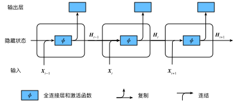

我们刚刚提到，隐藏状态中$\boldsymbol{X}_t \boldsymbol{W}_{xh} + \boldsymbol{H}_{t-1} \boldsymbol{W}_{hh}$的计算等价于$\boldsymbol{X}_t$与$\boldsymbol{H}_{t-1}$连结后的矩阵乘以$\boldsymbol{W}_{xh}$与$\boldsymbol{W}_{hh}$连结后的矩阵。接下来，我们用一个具体的例子来验证这一点。首先，我们构造矩阵`X`、`W_xh`、`H`和`W_hh`，它们的形状分别为(3, 1)、(1, 4)、(3, 4)和(4, 4)。将`X`与`W_xh`、`H`与`W_hh`分别相乘，再把两个乘法运算的结果相加，得到形状为(3, 4)的矩阵。

#### 代码实现

初始化模型：

```python
num_inputs, num_hiddens, num_outputs = vocab_size, 256, vocab_size
ctx = d2l.try_gpu()
print('will use', ctx)

def get_params():
    def _one(shape):
        return nd.random.normal(scale=0.01, shape=shape, ctx=ctx)

    # 隐藏层参数
    W_xh = _one((num_inputs, num_hiddens))
    W_hh = _one((num_hiddens, num_hiddens))
    b_h = nd.zeros(num_hiddens, ctx=ctx)
    # 输出层参数
    W_hq = _one((num_hiddens, num_outputs))
    b_q = nd.zeros(num_outputs, ctx=ctx)
    # 附上梯度
    params = [W_xh, W_hh, b_h, W_hq, b_q]
    for param in params:
        param.attach_grad()
```

据循环神经网络的计算表达式实现该模型。首先定义`init_rnn_state`函数来返回初始化的隐藏状态。它返回由一个形状为(批量大小, 隐藏单元个数)的值为0的`NDArray`组成的元组。使用元组是为了更便于处理隐藏状态含有多个`NDArray`的情况。

```python
#模型定义
def init_rnn_state(batch_size, num_hiddens, ctx):
    return (nd.zeros(shape=(batch_size, num_hiddens), ctx=ctx), )

def rnn(inputs, state, params):
    # inputs和outputs皆为num_steps个形状为(batch_size, vocab_size)的矩阵
    W_xh, W_hh, b_h, W_hq, b_q = params
    H, = state
    outputs = []
    for X in inputs:
        H = nd.tanh(nd.dot(X, W_xh) + nd.dot(H, W_hh) + b_h)
        Y = nd.dot(H, W_hq) + b_q
        outputs.append(Y)
    return outputs, (H,)
```


**预测函数**定义，基于前缀`prefix`（含有数个字符的字符串）来预测接下来的`num_chars`个字符。这个函数稍显复杂，其中我们将循环神经单元`rnn`设置成了函数参数，这样在后面小节介绍其他循环神经网络时能重复使用这个函数。

```python
def predict_rnn(prefix, num_chars, rnn, params, init_rnn_state,
                num_hiddens, vocab_size, ctx, idx_to_char, char_to_idx):
    state = init_rnn_state(1, num_hiddens, ctx)
    output = [char_to_idx[prefix[0]]]
    for t in range(num_chars + len(prefix) - 1):
        # 将上一时间步的输出作为当前时间步的输入
        X = to_onehot(nd.array([output[-1]], ctx=ctx), vocab_size)
        # 计算输出和更新隐藏状态
        (Y, state) = rnn(X, state, params)
        # 下一个时间步的输入是prefix里的字符或者当前的最佳预测字符
        if t < len(prefix) - 1:
            output.append(char_to_idx[prefix[t + 1]])
        else:
            output.append(int(Y[0].argmax(axis=1).asscalar()))
    return ''.join([idx_to_char[i] for i in output])
```

**裁剪梯度**，循环神经网络中较容易出现梯度衰减或梯度爆炸。为了应对梯度爆炸，我们可以裁剪梯度（clip gradient）。假设我们把所有模型参数梯度的元素拼接成一个向量 $\boldsymbol{g}$，并设裁剪的阈值是$\theta$。裁剪后的梯度

$ \min\left(\frac{\theta}{\|\boldsymbol{g}\|}, 1\right)\boldsymbol{g}$的$L_2$范数不超过$\theta$。

```python
def grad_clipping(params, theta, ctx):
    norm = nd.array([0], ctx)
    for param in params:
        norm += (param.grad ** 2).sum()
    norm = norm.sqrt().asscalar()
    if norm > theta:
        for param in params:
            param.grad[:] *= theta / norm
```

**模型评价，困惑度**

我们通常使用困惑度（perplexity）来评价语言模型的好坏困惑度是对交叉熵损失函数做指数运算后得到的值。特别地，

* 最佳情况下，模型总是把标签类别的概率预测为1，此时困惑度为1；
* 最坏情况下，模型总是把标签类别的概率预测为0，此时困惑度为正无穷；
* 基线情况下，模型总是预测所有类别的概率都相同，此时困惑度为类别个数。

**结合困惑度定义训练函数**

```python
def train_and_predict_rnn(rnn, get_params, init_rnn_state, num_hiddens,
                          vocab_size, ctx, corpus_indices, idx_to_char,
                          char_to_idx, is_random_iter, num_epochs, num_steps,
                          lr, clipping_theta, batch_size, pred_period,
                          pred_len, prefixes):
    if is_random_iter:
        data_iter_fn = d2l.data_iter_random
    else:
        data_iter_fn = d2l.data_iter_consecutive
    params = get_params()
    loss = gloss.SoftmaxCrossEntropyLoss()

    for epoch in range(num_epochs):
        if not is_random_iter:  # 如使用相邻采样，在epoch开始时初始化隐藏状态
            state = init_rnn_state(batch_size, num_hiddens, ctx)
        l_sum, n, start = 0.0, 0, time.time()
        data_iter = data_iter_fn(corpus_indices, batch_size, num_steps, ctx)
        for X, Y in data_iter:
            if is_random_iter:  # 如使用随机采样，在每个小批量更新前初始化隐藏状态
                state = init_rnn_state(batch_size, num_hiddens, ctx)
            else:  # 否则需要使用detach函数从计算图分离隐藏状态
                for s in state:
                    s.detach()
            with autograd.record():
                inputs = to_onehot(X, vocab_size)
                # outputs有num_steps个形状为(batch_size, vocab_size)的矩阵
                (outputs, state) = rnn(inputs, state, params)
                # 拼接之后形状为(num_steps * batch_size, vocab_size)
                outputs = nd.concat(*outputs, dim=0)
                # Y的形状是(batch_size, num_steps)，转置后再变成长度为
                # batch * num_steps 的向量，这样跟输出的行一一对应
                y = Y.T.reshape((-1,))
                # 使用交叉熵损失计算平均分类误差
                l = loss(outputs, y).mean()
            l.backward()
            grad_clipping(params, clipping_theta, ctx)  # 裁剪梯度
            d2l.sgd(params, lr, 1)  # 因为误差已经取过均值，梯度不用再做平均
            l_sum += l.asscalar() * y.size
            n += y.size

        if (epoch + 1) % pred_period == 0:
            print('epoch %d, perplexity %f, time %.2f sec' % (
                epoch + 1, math.exp(l_sum / n), time.time() - start))
            for prefix in prefixes:
                print(' -', predict_rnn(
                    prefix, pred_len, rnn, params, init_rnn_state,
                    num_hiddens, vocab_size, ctx, idx_to_char, char_to_idx))
```

**使用深度学习框架来定义简单CNN**

1. 模型定义

```python
num_hiddens = 256
rnn_layer = rnn.RNN(num_hiddens)
rnn_layer.initialize()

batch_size = 2
state = rnn_layer.begin_state(batch_size=batch_size)
state[0].shape
```

2. 网络定义

```python
class RNNModel(nn.Block):
    def __init__(self, rnn_layer, vocab_size, **kwargs):
        super(RNNModel, self).__init__(**kwargs)
        self.rnn = rnn_layer
        self.vocab_size = vocab_size
        self.dense = nn.Dense(vocab_size)

    def forward(self, inputs, state):
        # 将输入转置成(num_steps, batch_size)后获取one-hot向量表示
        X = nd.one_hot(inputs.T, self.vocab_size)
        Y, state = self.rnn(X, state)
        # 全连接层会首先将Y的形状变成(num_steps * batch_size, num_hiddens)，它的输出
        # 形状为(num_steps * batch_size, vocab_size)
        output = self.dense(Y.reshape((-1, Y.shape[-1])))
        return output, state

    def begin_state(self, *args, **kwargs):
        return self.rnn.begin_state(*args, **kwargs)
```


#### 总结

循环神经网络的隐藏状态可以捕捉截至当前时间步的序列的历史信息。可以基于字符级循环神经网络来创建语言模型。

### 语言模型

语言模型（language model）是自然语言处理的重要技术。自然语言处理中最常见的数据是文本数据。我们可以把一段自然语言文本看作一段离散的时间序列。假设一段长度为$T$的文本中的词依次为$w_1, w_2, \ldots, w_T$，那么在离散的时间序列中，$w_t$（$1 \leq t \leq T$）可看作在时间步（time step）$t$的输出或标签。给定一个长度为$T$的词的序列$w_1, w_2, \ldots, w_T$，语言模型将计算该序列的概率：

$$P(w_1, w_2, \ldots, w_T).$$


语言模型可用于提升语音识别和机器翻译的性能。例如，在语音识别中，给定一段“厨房里食油用完了”的语音，有可能会输出“厨房里食油用完了”和“厨房里石油用完了”这两个读音完全一样的文本序列。如果语言模型判断出前者的概率大于后者的概率，我们就可以根据相同读音的语音输出“厨房里食油用完了”的文本序列。在机器翻译中，如果对英文“you go first”逐词翻译成中文的话，可能得到“你走先”“你先走”等排列方式的文本序列。如果语言模型判断出“你先走”的概率大于其他排列方式的文本序列的概率，我们就可以把“you go first”翻译成“你先走”。

#### 计算问题

既然语言模型很有用，那该如何计算它呢？假设序列$w_1, w_2, \ldots, w_T$中的每个词是依次生成的，我们有

$$P(w_1, w_2, \ldots, w_T) = \prod_{t=1}^T P(w_t \mid w_1, \ldots, w_{t-1}).$$

例如，一段含有4个词的文本序列的概率

$$P(w_1, w_2, w_3, w_4) =  P(w_1) P(w_2 \mid w_1) P(w_3 \mid w_1, w_2) P(w_4 \mid w_1, w_2, w_3).$$

为了计算语言模型，我们需要计算词的概率，以及一个词在给定前几个词的情况下的条件概率，即语言模型参数。设训练数据集为一个大型文本语料库，如维基百科的所有条目。词的概率可以通过该词在训练数据集中的相对词频来计算。例如，$P(w_1)$可以计算为$w_1$在训练数据集中的词频（词出现的次数）与训练数据集的总词数之比。因此，根据条件概率定义，一个词在给定前几个词的情况下的条件概率也可以通过训练数据集中的相对词频计算。例如，$P(w_2 \mid w_1)$可以计算为$w_1, w_2$两词相邻的频率与$w_1$词频的比值，因为该比值即$P(w_1, w_2)$与$P(w_1)$之比；而$P(w_3 \mid w_1, w_2)$同理可以计算为$w_1$、$w_2$和$w_3$三词相邻的频率与$w_1$和$w_2$两词相邻的频率的比值。以此类推。

### GRU

当时间步数较大或者时间步较小时，循环神经网络的梯度较容易出现衰减或爆炸。虽然裁剪梯度可以应对梯度爆炸，但无法解决梯度衰减的问题。通常由于这个原因，循环神经网络在实际中较难捕捉时间序列中时间步距离较大的依赖关系。门控循环神经网络（gated recurrent neural  network）的提出，正是为了更好地捕捉时间序列中时间步距离较大的依赖关系。它通过可以学习的门来控制信息的流动。其中，门控循环单元（gated recurrent unit，GRU）是一种常用的门控循环神经网络.

#### 重置门和更新门

如图所示，门控循环单元中的重置门和更新门的输入均为当前时间步输入$\boldsymbol{X}_t$与上一时间步隐藏状态$\boldsymbol{H}_{t-1}$，输出由激活函数为sigmoid函数的全连接层计算得到。


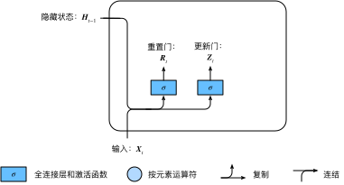


具体来说，假设隐藏单元个数为$h$，给定时间步$t$的小批量输入$\boldsymbol{X}_t \in \mathbb{R}^{n \times d}$（样本数为$n$，输入个数为$d$）和上一时间步隐藏状态$\boldsymbol{H}_{t-1} \in \mathbb{R}^{n \times h}$。重置门$\boldsymbol{R}_t \in \mathbb{R}^{n \times h}$和更新门$\boldsymbol{Z}_t \in \mathbb{R}^{n \times h}$的计算如下：

$$
\begin{aligned}
\boldsymbol{R}_t = \sigma(\boldsymbol{X}_t \boldsymbol{W}_{xr} + \boldsymbol{H}_{t-1} \boldsymbol{W}_{hr} + \boldsymbol{b}_r),\\
\boldsymbol{Z}_t = \sigma(\boldsymbol{X}_t \boldsymbol{W}_{xz} + \boldsymbol{H}_{t-1} \boldsymbol{W}_{hz} + \boldsymbol{b}_z),
\end{aligned}
$$

其中$\boldsymbol{W}_{xr}, \boldsymbol{W}_{xz} \in \mathbb{R}^{d \times h}$和$\boldsymbol{W}_{hr}, \boldsymbol{W}_{hz} \in \mathbb{R}^{h \times h}$是权重参数，$\boldsymbol{b}_r, \boldsymbol{b}_z \in \mathbb{R}^{1 \times h}$是偏差参数。重置门$\boldsymbol{R}_t$和更新门$\boldsymbol{Z}_t$中每个元素的值域都是$[0, 1]$。

#### 候选隐藏状态

接下来，门控循环单元将计算候选隐藏状态来辅助稍后的隐藏状态计算。如图6.5所示，我们将当前时间步重置门的输出与上一时间步隐藏状态做按元素乘法（符号为$\odot$）。如果重置门中元素值接近0，那么意味着重置对应隐藏状态元素为0，即丢弃上一时间步的隐藏状态。如果元素值接近1，那么表示保留上一时间步的隐藏状态。然后，将按元素乘法的结果与当前时间步的输入连结，再通过含激活函数tanh的全连接层计算出候选隐藏状态，其所有元素的值域为$[-1, 1]$。

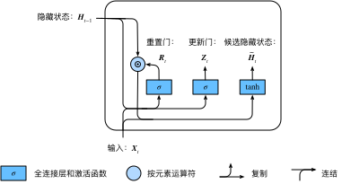

具体来说，时间步$t$的候选隐藏状态$\tilde{\boldsymbol{H}}_t \in \mathbb{R}^{n \times h}$的计算为

$$\tilde{\boldsymbol{H}}_t = \text{tanh}(\boldsymbol{X}_t \boldsymbol{W}_{xh} + \left(\boldsymbol{R}_t \odot \boldsymbol{H}_{t-1}\right) \boldsymbol{W}_{hh} + \boldsymbol{b}_h),$$

其中$\boldsymbol{W}_{xh} \in \mathbb{R}^{d \times h}$和$\boldsymbol{W}_{hh} \in \mathbb{R}^{h \times h}$是权重参数，$\boldsymbol{b}_h \in \mathbb{R}^{1 \times h}$是偏差参数。从上面这个公式可以看出，重置门控制了上一时间步的隐藏状态如何流入当前时间步的候选隐藏状态。而上一时间步的隐藏状态可能包含了时间序列截至上一时间步的全部历史信息。因此，重置门可以用来丢弃与预测无关的历史信息。

#### 隐藏状态

最后，时间步$t$的隐藏状态$\boldsymbol{H}_t \in \mathbb{R}^{n \times h}$的计算使用当前时间步的更新门$\boldsymbol{Z}_t$来对上一时间步的隐藏状态$\boldsymbol{H}_{t-1}$和当前时间步的候选隐藏状态$\tilde{\boldsymbol{H}}_t$做组合：

$$\boldsymbol{H}_t = \boldsymbol{Z}_t \odot \boldsymbol{H}_{t-1}  + (1 - \boldsymbol{Z}_t) \odot \tilde{\boldsymbol{H}}_t.$$


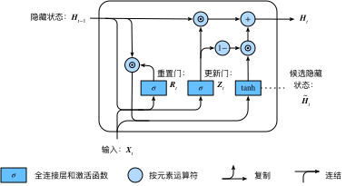


值得注意的是，更新门可以控制隐藏状态应该如何被包含当前时间步信息的候选隐藏状态所更新，如图6.6所示。假设更新门在时间步$t'$到$t$（$t' < t$）之间一直近似1。那么，在时间步$t'$到$t$之间的输入信息几乎没有流入时间步$t$的隐藏状态$\boldsymbol{H}_t$。实际上，这可以看作是较早时刻的隐藏状态$\boldsymbol{H}_{t'-1}$一直通过时间保存并传递至当前时间步$t$。这个设计可以应对循环神经网络中的梯度衰减问题，并更好地捕捉时间序列中时间步距离较大的依赖关系。

我们对门控循环单元的设计稍作总结：

* 重置门有助于捕捉时间序列里短期的依赖关系；
* 更新门有助于捕捉时间序列里长期的依赖关系。

#### 定义模型

```python
def init_gru_state(batch_size, num_hiddens, ctx):
    return (nd.zeros(shape=(batch_size, num_hiddens), ctx=ctx), )
 
def gru(inputs, state, params):
    W_xz, W_hz, b_z, W_xr, W_hr, b_r, W_xh, W_hh, b_h, W_hq, b_q = params
    H, = state
    outputs = []
    for X in inputs:
        Z = nd.sigmoid(nd.dot(X, W_xz) + nd.dot(H, W_hz) + b_z)
        R = nd.sigmoid(nd.dot(X, W_xr) + nd.dot(H, W_hr) + b_r)
        H_tilda = nd.tanh(nd.dot(X, W_xh) + nd.dot(R * H, W_hh) + b_h)
        H = Z * H + (1 - Z) * H_tilda
        Y = nd.dot(H, W_hq) + b_q
        outputs.append(Y)
    return outputs, (H,)
```

#### 总结

- 门控循环神经网络可以更好地捕捉时间序列中时间步距离较大的依赖关系。
- 门控循环单元引入了门的概念，从而修改了循环神经网络中隐藏状态的计算方式。它包括重置门、更新门、候选隐藏状态和隐藏状态。
- 重置门有助于捕捉时间序列里短期的依赖关系。
- 更新门有助于捕捉时间序列里长期的依赖关系。

### LSTM

在GRU的基础上增加了门，引入了3个门，即输入门（input gate）、遗忘门（forget gate）和输出门（output gate），以及与隐藏状态形状相同的记忆细胞（某些文献把记忆细胞当成一种特殊的隐藏状态），从而记录额外的信息。

#### 输入门、遗忘门和输出门

与门控循环单元中的重置门和更新门一样，如图6.7所示，长短期记忆的门的输入均为当前时间步输入$\boldsymbol{X}_t$与上一时间步隐藏状态$\boldsymbol{H}_{t-1}$，输出由激活函数为sigmoid函数的全连接层计算得到。如此一来，这3个门元素的值域均为$[0,1]$。


具体来说，假设隐藏单元个数为$h$，给定时间步$t$的小批量输入$\boldsymbol{X}_t \in \mathbb{R}^{n \times d}$（样本数为$n$，输入个数为$d$）和上一时间步隐藏状态$\boldsymbol{H}_{t-1} \in \mathbb{R}^{n \times h}$。
时间步$t$的输入门$\boldsymbol{I}_t \in \mathbb{R}^{n \times h}$、遗忘门$\boldsymbol{F}_t \in \mathbb{R}^{n \times h}$和输出门$\boldsymbol{O}_t \in \mathbb{R}^{n \times h}$分别计算如下：

$$
\begin{aligned}
\boldsymbol{I}_t &= \sigma(\boldsymbol{X}_t \boldsymbol{W}_{xi} + \boldsymbol{H}_{t-1} \boldsymbol{W}_{hi} + \boldsymbol{b}_i),\\
\boldsymbol{F}_t &= \sigma(\boldsymbol{X}_t \boldsymbol{W}_{xf} + \boldsymbol{H}_{t-1} \boldsymbol{W}_{hf} + \boldsymbol{b}_f),\\
\boldsymbol{O}_t &= \sigma(\boldsymbol{X}_t \boldsymbol{W}_{xo} + \boldsymbol{H}_{t-1} \boldsymbol{W}_{ho} + \boldsymbol{b}_o),
\end{aligned}
$$

其中的$\boldsymbol{W}_{xi}, \boldsymbol{W}_{xf}, \boldsymbol{W}_{xo} \in \mathbb{R}^{d \times h}$和$\boldsymbol{W}_{hi}, \boldsymbol{W}_{hf}, \boldsymbol{W}_{ho} \in \mathbb{R}^{h \times h}$是权重参数，$\boldsymbol{b}_i, \boldsymbol{b}_f, \boldsymbol{b}_o \in \mathbb{R}^{1 \times h}$是偏差参数。

#### 候选记忆细胞

接下来，长短期记忆需要计算候选记忆细胞$\tilde{\boldsymbol{C}}_t$。它的计算与上面介绍的3个门类似，但使用了值域在$[-1, 1]$的tanh函数作为激活函数，如图6.8所示。

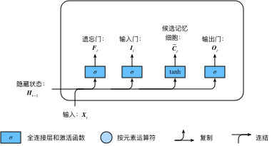


具体来说，时间步$t$的候选记忆细胞$\tilde{\boldsymbol{C}}_t \in \mathbb{R}^{n \times h}$的计算为

$$\tilde{\boldsymbol{C}}_t = \text{tanh}(\boldsymbol{X}_t \boldsymbol{W}_{xc} + \boldsymbol{H}_{t-1} \boldsymbol{W}_{hc} + \boldsymbol{b}_c),$$

其中$\boldsymbol{W}_{xc} \in \mathbb{R}^{d \times h}$和$\boldsymbol{W}_{hc} \in \mathbb{R}^{h \times h}$是权重参数，$\boldsymbol{b}_c \in \mathbb{R}^{1 \times h}$是偏差参数。

#### 记忆node

我们可以通过元素值域在$[0, 1]$的输入门、遗忘门和输出门来控制隐藏状态中信息的流动，这一般也是通过使用按元素乘法（符号为$\odot$）来实现的。当前时间步记忆细胞$\boldsymbol{C}_t \in \mathbb{R}^{n \times h}$的计算组合了上一时间步记忆细胞和当前时间步候选记忆细胞的信息，并通过遗忘门和输入门来控制信息的流动：

$$\boldsymbol{C}_t = \boldsymbol{F}_t \odot \boldsymbol{C}_{t-1} + \boldsymbol{I}_t \odot \tilde{\boldsymbol{C}}_t.$$


如图6.9所示，遗忘门控制上一时间步的记忆细胞$\boldsymbol{C}_{t-1}$中的信息是否传递到当前时间步，而输入门则控制当前时间步的输入$\boldsymbol{X}_t$通过候选记忆细胞$\tilde{\boldsymbol{C}}_t$如何流入当前时间步的记忆细胞。如果遗忘门一直近似1且输入门一直近似0，过去的记忆细胞将一直通过时间保存并传递至当前时间步。这个设计可以应对循环神经网络中的梯度衰减问题，并更好地捕捉时间序列中时间步距离较大的依赖关系。

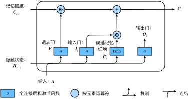

#### 隐藏状态

有了记忆细胞以后，接下来我们还可以通过输出门来控制从记忆细胞到隐藏状态$\boldsymbol{H}_t \in \mathbb{R}^{n \times h}$的信息的流动：

$$\boldsymbol{H}_t = \boldsymbol{O}_t \odot \text{tanh}(\boldsymbol{C}_t).$$

这里的tanh函数确保隐藏状态元素值在-1到1之间。需要注意的是，当输出门近似1时，记忆细胞信息将传递到隐藏状态供输出层使用；当输出门近似0时，记忆细胞信息只自己保留。图6.10展示了长短期记忆中隐藏状态的计算。

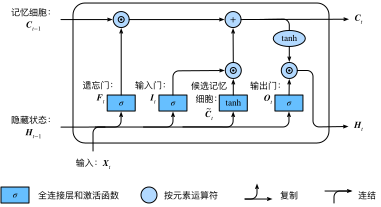

#### 简单实现

```python
# 参数初始化
num_inputs, num_hiddens, num_outputs = vocab_size, 256, vocab_size
ctx = d2l.try_gpu()

def get_params():
    def _one(shape):
        return nd.random.normal(scale=0.01, shape=shape, ctx=ctx)

    def _three():
        return (_one((num_inputs, num_hiddens)),
                _one((num_hiddens, num_hiddens)),
                nd.zeros(num_hiddens, ctx=ctx))

    W_xi, W_hi, b_i = _three()  # 输入门参数
    W_xf, W_hf, b_f = _three()  # 遗忘门参数
    W_xo, W_ho, b_o = _three()  # 输出门参数
    W_xc, W_hc, b_c = _three()  # 候选记忆细胞参数
    # 输出层参数
    W_hq = _one((num_hiddens, num_outputs))
    b_q = nd.zeros(num_outputs, ctx=ctx)
    # 附上梯度
    params = [W_xi, W_hi, b_i, W_xf, W_hf, b_f, W_xo, W_ho, b_o, W_xc, W_hc,
              b_c, W_hq, b_q]
    for param in params:
        param.attach_grad()
    return params
  
# 模型定义
def init_lstm_state(batch_size, num_hiddens, ctx):
    return (nd.zeros(shape=(batch_size, num_hiddens), ctx=ctx),
            nd.zeros(shape=(batch_size, num_hiddens), ctx=ctx))
def lstm(inputs, state, params):
    [W_xi, W_hi, b_i, W_xf, W_hf, b_f, W_xo, W_ho, b_o, W_xc, W_hc, b_c,
     W_hq, b_q] = params
    (H, C) = state
    outputs = []
    for X in inputs:
        I = nd.sigmoid(nd.dot(X, W_xi) + nd.dot(H, W_hi) + b_i)
        F = nd.sigmoid(nd.dot(X, W_xf) + nd.dot(H, W_hf) + b_f)
        O = nd.sigmoid(nd.dot(X, W_xo) + nd.dot(H, W_ho) + b_o)
        C_tilda = nd.tanh(nd.dot(X, W_xc) + nd.dot(H, W_hc) + b_c)
        C = F * C + I * C_tilda
        H = O * C.tanh()
        Y = nd.dot(H, W_hq) + b_q
        outputs.append(Y)
    return outputs, (H, C)
```

**利用框架实现**

```python
stm_layer = rnn.LSTM(num_hiddens)
model = d2l.RNNModel(lstm_layer, vocab_size)
d2l.train_and_predict_rnn_gluon(model, num_hiddens, vocab_size, ctx,
                                corpus_indices, idx_to_char, char_to_idx,
                                num_epochs, num_steps, lr, clipping_theta,
                                batch_size, pred_period, pred_len, prefixes)
                                
```

#### 总结

长短期记忆的隐藏层输出包括隐藏状态和记忆细胞。只有隐藏状态会传递到输出层。长短期记忆的输入门、遗忘门和输出门可以控制信息的流动。长短期记忆可以应对循环神经网络中的梯度衰减问题，并更好地捕捉时间序列中时间步距离较大的依赖关系。

### 深度RNN

同样当处理复杂的问题是，更深的模型往往会效果更佳。

图$L$个隐藏层的深度循环神经网络，每个隐藏状态不断传递至当前层的下一时间步和当前时间步的下一层。

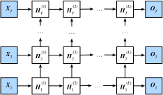


具体来说，在时间步$t$里，设小批量输入$\boldsymbol{X}_t \in \mathbb{R}^{n \times d}$（样本数为$n$，输入个数为$d$），第$\ell$隐藏层（$\ell=1,\ldots,L$）的隐藏状态为$\boldsymbol{H}_t^{(\ell)}  \in \mathbb{R}^{n \times h}$（隐藏单元个数为$h$），输出层变量为$\boldsymbol{O}_t \in \mathbb{R}^{n \times q}$（输出个数为$q$），且隐藏层的激活函数为$\phi$。第1隐藏层的隐藏状态和之前的计算一样：

$$\boldsymbol{H}_t^{(1)} = \phi(\boldsymbol{X}_t \boldsymbol{W}_{xh}^{(1)} + \boldsymbol{H}_{t-1}^{(1)} \boldsymbol{W}_{hh}^{(1)}  + \boldsymbol{b}_h^{(1)}),$$


其中权重$\boldsymbol{W}_{xh}^{(1)} \in \mathbb{R}^{d \times h}$、$\boldsymbol{W}_{hh}^{(1)} \in \mathbb{R}^{h \times h}$和偏差 $\boldsymbol{b}_h^{(1)} \in \mathbb{R}^{1 \times h}$分别为第1隐藏层的模型参数。

当$1 < \ell \leq L$时，第$\ell$隐藏层的隐藏状态的表达式为

$$\boldsymbol{H}_t^{(\ell)} = \phi(\boldsymbol{H}_t^{(\ell-1)} \boldsymbol{W}_{xh}^{(\ell)} + \boldsymbol{H}_{t-1}^{(\ell)} \boldsymbol{W}_{hh}^{(\ell)}  + \boldsymbol{b}_h^{(\ell)}),$$


其中权重$\boldsymbol{W}_{xh}^{(\ell)} \in \mathbb{R}^{h \times h}$、$\boldsymbol{W}_{hh}^{(\ell)} \in \mathbb{R}^{h \times h}$和偏差 $\boldsymbol{b}_h^{(\ell)} \in \mathbb{R}^{1 \times h}$分别为第$\ell$隐藏层的模型参数。

最终，输出层的输出只需基于第$L$隐藏层的隐藏状态：

$$\boldsymbol{O}_t = \boldsymbol{H}_t^{(L)} \boldsymbol{W}_{hq} + \boldsymbol{b}_q,$$

其中权重$\boldsymbol{W}_{hq} \in \mathbb{R}^{h \times q}$和偏差$\boldsymbol{b}_q \in \mathbb{R}^{1 \times q}$为输出层的模型参数。

同多层感知机一样，隐藏层个数$L$和隐藏单元个数$h$都是超参数。此外，如果将隐藏状态的计算换成门控循环单元或者长短期记忆的计算，我们可以得到深度门控循环神经网络。

#### 双向RNN

一般循环神经网络模型都是假设当前时间步是由前面的较早时间步的序列决定的，因此它们都将信息通过隐藏状态从前往后传递。有时候，当前时间步也可能由后面时间步决定。例如，当我们写下一个句子时，可能会根据句子后面的词来修改句子前面的用词。双向循环神经网络通过增加从后往前传递信息的隐藏层来更灵活地处理这类信息。图6.12演示了一个含单隐藏层的双向循环神经网络的架构。

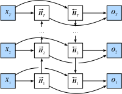

下面我们来介绍具体的定义。
给定时间步$t$的小批量输入$\boldsymbol{X}_t \in \mathbb{R}^{n \times d}$（样本数为$n$，输入个数为$d$）和隐藏层激活函数为$\phi$。在双向循环神经网络的架构中，
设该时间步正向隐藏状态为$\overrightarrow{\boldsymbol{H}}_t  \in \mathbb{R}^{n \times h}$（正向隐藏单元个数为$h$），
反向隐藏状态为$\overleftarrow{\boldsymbol{H}}_t  \in \mathbb{R}^{n \times h}$（反向隐藏单元个数为$h$）。我们可以分别计算正向隐藏状态和反向隐藏状态：

$$
\begin{aligned}
\overrightarrow{\boldsymbol{H}}_t &= \phi(\boldsymbol{X}_t \boldsymbol{W}_{xh}^{(f)} + \overrightarrow{\boldsymbol{H}}_{t-1} \boldsymbol{W}_{hh}^{(f)}  + \boldsymbol{b}_h^{(f)}),\\
\overleftarrow{\boldsymbol{H}}_t &= \phi(\boldsymbol{X}_t \boldsymbol{W}_{xh}^{(b)} + \overleftarrow{\boldsymbol{H}}_{t+1} \boldsymbol{W}_{hh}^{(b)}  + \boldsymbol{b}_h^{(b)}),
\end{aligned}
$$

其中权重$\boldsymbol{W}_{xh}^{(f)} \in \mathbb{R}^{d \times h}$、$\boldsymbol{W}_{hh}^{(f)} \in \mathbb{R}^{h \times h}$、$\boldsymbol{W}_{xh}^{(b)} \in \mathbb{R}^{d \times h}$、$\boldsymbol{W}_{hh}^{(b)} \in \mathbb{R}^{h \times h}$和偏差 $\boldsymbol{b}_h^{(f)} \in \mathbb{R}^{1 \times h}$、$\boldsymbol{b}_h^{(b)} \in \mathbb{R}^{1 \times h}$均为模型参数。

然后我们连结两个方向的隐藏状态$\overrightarrow{\boldsymbol{H}}_t$和$\overleftarrow{\boldsymbol{H}}_t$来得到隐藏状态$\boldsymbol{H}_t \in \mathbb{R}^{n \times 2h}$，并将其输入到输出层。输出层计算输出$\boldsymbol{O}_t \in \mathbb{R}^{n \times q}$（输出个数为$q$）：

$$\boldsymbol{O}_t = \boldsymbol{H}_t \boldsymbol{W}_{hq} + \boldsymbol{b}_q,$$

其中权重$\boldsymbol{W}_{hq} \in \mathbb{R}^{2h \times q}$和偏差$\boldsymbol{b}_q \in \mathbb{R}^{1 \times q}$为输出层的模型参数。不同方向上的隐藏单元个数也可以不同。

## CV

### 图像增强

大规模数据集是成功应用深度神经网络的前提。图像增广（image augmentation）技术通过对训练图像做一系列随机改变，来产生相似但又不同的训练样本，从而扩大训练数据集的规模。图像增广的另一种解释是，随机改变训练样本可以降低模型对某些属性的依赖，从而提高模型的泛化能力。例如，我们可以对图像进行不同方式的裁剪，使感兴趣的物体出现在不同位置，从而减轻模型对物体出现位置的依赖性。我们也可以调整亮度、色彩等因素来降低模型对色彩的敏感度。可以说，在当年AlexNet的成功中，图像增广技术功不可没。本节我们将讨论这个在计算机视觉里被广泛使用的技术。

- 翻转裁切，左右翻转图像通常不改变物体的类别。它是最早也是最广泛使用的一种图像增广方法。下面我们通过`transforms`模块创建`RandomFlipLeftRight`实例来实现一半概率的图像左右翻转。

- 变换颜色，我们可以从4个方面改变图像的颜色：亮度、对比度、饱和度和色调。
- 叠加多个图像，实际应用中我们会将多个图像增广方法叠加使用。我们可以通过`Compose`实例将上面定义的多个图像增广方法叠加起来，再应用到每张图像之上。


### Fine Tuning

假设我们想从图像中识别出不同种类的椅子，然后将购买链接推荐给用户。一种可能的方法是先找出100种常见的椅子，为每种椅子拍摄1,000张不同角度的图像，然后在收集到的图像数据集上训练一个分类模型。这个椅子数据集虽然可能比Fashion-MNIST数据集要庞大，但样本数仍然不及ImageNet数据集中样本数的十分之一。这可能会导致适用于ImageNet数据集的复杂模型在这个椅子数据集上过拟合。同时，因为数据量有限，最终训练得到的模型的精度也可能达不到实用的要求。

为了应对上述问题，一个显而易见的解决办法是收集更多的数据。然而，收集和标注数据会花费大量的时间和资金。例如，为了收集ImageNet数据集，研究人员花费了数百万美元的研究经费。虽然目前的数据采集成本已降低了不少，但其成本仍然不可忽略。

这样的问题可以通过微调解决：

1. 在源数据集（如ImageNet数据集）上预训练一个神经网络模型，即源模型。
2. 创建一个新的神经网络模型，即目标模型。它复制了源模型上除了输出层外的所有模型设计及其参数。我们假设这些模型参数包含了源数据集上学习到的知识，且这些知识同样适用于目标数据集。我们还假设源模型的输出层跟源数据集的标签紧密相关，因此在目标模型中不予采用。
3. 为目标模型添加一个输出大小为目标数据集类别个数的输出层，并随机初始化该层的模型参数。
4. 在目标数据集（如椅子数据集）上训练目标模型。我们将从头训练输出层，而其余层的参数都是基于源模型的参数微调得到的。


当目标数据集远小于源数据集时，微调有助于提升模型的泛化能力。

#### 总结

* 迁移学习将从源数据集学到的知识迁移到目标数据集上。微调是迁移学习的一种常用技术。
* 目标模型复制了源模型上除了输出层外的所有模型设计及其参数，并基于目标数据集微调这些参数。而目标模型的输出层需要从头训练。
* 一般来说，微调参数会使用较小的学习率，而从头训练输出层可以使用较大的学习率。

### Bounding Box

我们通常使用边界框（bounding box）来描述目标位置。边界框是一个矩形框，可以由矩形左上角的*𝑥*和*𝑦*轴坐标与右下角的*𝑥*和*𝑦*轴坐标确定。我们根据上面的图的坐标信息来定义图中狗和猫的边界框。图中的坐标原点在图像的左上角，原点往右和往下分别为*𝑥*轴和*𝑦*轴的正方向。

```python
# bbox是bounding box的缩写
dog_bbox, cat_bbox = [60, 45, 378, 516], [400, 112, 655, 493]

ef bbox_to_rect(bbox, color):  # 本函数已保存在d2lzh包中方便以后使用
    # 将边界框(左上x, 左上y, 右下x, 右下y)格式转换成matplotlib格式：
    # ((左上x, 左上y), 宽, 高)
    return d2l.plt.Rectangle(
        xy=(bbox[0], bbox[1]), width=bbox[2]-bbox[0], height=bbox[3]-bbox[1],
        fill=False, edgecolor=color, linewidth=2)
```

### Anchor Box

目标检测算法通常会在输入图像中采样大量的区域，然后判断这些区域中是否包含我们感兴趣的目标，并调整区域边缘从而更准确地预测目标的真实边界框（ground-truth bounding  box）。不同的模型使用的区域采样方法可能不同。这里我们介绍其中的一种方法：它以每个像素为中心生成多个大小和宽高比（aspect  ratio）不同的边界框。这些边界框被称为锚框（anchor box）。

#### Anchor Box 的生成

假设输入图像高为$h$，宽为$w$。我们分别以图像的每个像素为中心生成不同形状的锚框。设大小为$s\in (0,1]$且宽高比为$r > 0$，那么锚框的宽和高将分别为$ws\sqrt{r}$和$hs/\sqrt{r}$。当中心位置给定时，已知宽和高的锚框是确定的。

下面我们分别设定好一组大小$s_1,\ldots,s_n$和一组宽高比$r_1,\ldots,r_m$。如果以每个像素为中心时使用所有的大小与宽高比的组合，输入图像将一共得到$whnm$个锚框。虽然这些锚框可能覆盖了所有的真实边界框，但计算复杂度容易过高。因此，我们通常只对包含$s_1$或$r_1$的大小与宽高比的组合感兴趣，即

$$(s_1, r_1), (s_1, r_2), \ldots, (s_1, r_m), (s_2, r_1), (s_3, r_1), \ldots, (s_n, r_1).$$

也就是说，以相同像素为中心的锚框的数量为$n+m-1$。对于整个输入图像，我们将一共生成$wh(n+m-1)$个锚框。

以上生成锚框的方法已实现在`MultiBoxPrior`函数中。指定输入、一组大小和一组宽高比，该函数将返回输入的所有锚框。

#### 交并比 IoU

如果该目标的真实边界框已知，这里的“较好”该如何量化呢？一种直观的方法是衡量锚框和真实边界框之间的相似度。我们知道，Jaccard系数（Jaccard index）可以衡量两个集合的相似度。给定集合$\mathcal{A}$和$\mathcal{B}$，它们的Jaccard系数即二者交集大小除以二者并集大小：

$$J(\mathcal{A},\mathcal{B}) = \frac{\left|\mathcal{A} \cap \mathcal{B}\right|}{\left| \mathcal{A} \cup \mathcal{B}\right|}.$$


实际上，我们可以把边界框内的像素区域看成是像素的集合。如此一来，我们可以用两个边界框的像素集合的Jaccard系数衡量这两个边界框的相似度。当衡量两个边界框的相似度时，我们通常将Jaccard系数称为交并比（intersection over union，IoU），即两个边界框相交面积与相并面积之比，如图9.2所示。交并比的取值范围在0和1之间：0表示两个边界框无重合像素，1表示两个边界框相等。

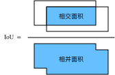

在本节的剩余部分，我们将使用交并比来衡量锚框与真实边界框以及锚框与锚框之间的相似度。

#### 训练集上标记处Anchor

训练集中，我们将每个锚框视为一个训练样本。为了训练目标检测模型，我们需要为每个锚框标注两类标签：一是锚框所含目标的类别，简称类别；二是真实边界框相对锚框的偏移量，简称偏移量（offset）。在目标检测时，我们首先生成多个锚框，然后为每个锚框预测类别以及偏移量，接着根据预测的偏移量调整锚框位置从而得到预测边界框，最后筛选需要输出的预测边界框。


我们知道，在目标检测的训练集中，每个图像已标注了真实边界框的位置以及所含目标的类别。在生成锚框之后，我们主要依据与锚框相似的真实边界框的位置和类别信息为锚框标注。那么，该如何为锚框分配与其相似的真实边界框呢？


假设图像中锚框分别为$A_1, A_2, \ldots, A_{n_a}$，真实边界框分别为$B_1, B_2, \ldots, B_{n_b}$，且$n_a \geq n_b$。定义矩阵$\boldsymbol{X} \in \mathbb{R}^{n_a \times n_b}$，其中第$i$行第$j$列的元素$x_{ij}$为锚框$A_i$与真实边界框$B_j$的交并比。
首先，我们找出矩阵$\boldsymbol{X}$中最大元素，并将该元素的行索引与列索引分别记为$i_1,j_1$。我们为锚框$A_{i_1}$分配真实边界框$B_{j_1}$。显然，锚框$A_{i_1}$和真实边界框$B_{j_1}$在所有的“锚框—真实边界框”的配对中相似度最高。接下来，将矩阵$\boldsymbol{X}$中第$i_1$行和第$j_1$列上的所有元素丢弃。找出矩阵$\boldsymbol{X}$中剩余的最大元素，并将该元素的行索引与列索引分别记为$i_2,j_2$。我们为锚框$A_{i_2}$分配真实边界框$B_{j_2}$，再将矩阵$\boldsymbol{X}$中第$i_2$行和第$j_2$列上的所有元素丢弃。此时矩阵$\boldsymbol{X}$中已有两行两列的元素被丢弃。
依此类推，直到矩阵$\boldsymbol{X}$中所有$n_b$列元素全部被丢弃。这个时候，我们已为$n_b$个锚框各分配了一个真实边界框。
接下来，我们只遍历剩余的$n_a - n_b$个锚框：给定其中的锚框$A_i$，根据矩阵$\boldsymbol{X}$的第$i$行找到与$A_i$交并比最大的真实边界框$B_j$，且只有当该交并比大于预先设定的阈值时，才为锚框$A_i$分配真实边界框$B_j$。


如图9.3（左）所示，假设矩阵$\boldsymbol{X}$中最大值为$x_{23}$，我们将为锚框$A_2$分配真实边界框$B_3$。然后，丢弃矩阵中第2行和第3列的所有元素，找出剩余阴影部分的最大元素$x_{71}$，为锚框$A_7$分配真实边界框$B_1$。接着如图9.3（中）所示，丢弃矩阵中第7行和第1列的所有元素，找出剩余阴影部分的最大元素$x_{54}$，为锚框$A_5$分配真实边界框$B_4$。最后如图9.3（右）所示，丢弃矩阵中第5行和第4列的所有元素，找出剩余阴影部分的最大元素$x_{92}$，为锚框$A_9$分配真实边界框$B_2$。之后，我们只需遍历除去$A_2, A_5, A_7, A_9$的剩余锚框，并根据阈值判断是否为剩余锚框分配真实边界框。

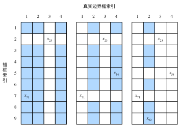


现在我们可以标注锚框的类别和偏移量了。如果一个锚框$A$被分配了真实边界框$B$，将锚框$A$的类别设为$B$的类别，并根据$B$和$A$的中心坐标的相对位置以及两个框的相对大小为锚框$A$标注偏移量。由于数据集中各个框的位置和大小各异，因此这些相对位置和相对大小通常需要一些特殊变换，才能使偏移量的分布更均匀从而更容易拟合。设锚框$A$及其被分配的真实边界框$B$的中心坐标分别为$(x_a, y_a)$和$(x_b, y_b)$，$A$和$B$的宽分别为$w_a$和$w_b$，高分别为$h_a$和$h_b$，一个常用的技巧是将$A$的偏移量标注为

$$\left( \frac{ \frac{x_b - x_a}{w_a} - \mu_x }{\sigma_x},
\frac{ \frac{y_b - y_a}{h_a} - \mu_y }{\sigma_y},
\frac{ \log \frac{w_b}{w_a} - \mu_w }{\sigma_w},
\frac{ \log \frac{h_b}{h_a} - \mu_h }{\sigma_h}\right),$$

其中常数的默认值为$\mu_x = \mu_y = \mu_w = \mu_h = 0, \sigma_x=\sigma_y=0.1, \sigma_w=\sigma_h=0.2$。如果一个锚框没有被分配真实边界框，我们只需将该锚框的类别设为背景。类别为背景的锚框通常被称为负类锚框，其余则被称为正类锚框。

#### 预测bounding box输出

在模型预测阶段，我们先为图像生成多个锚框，并为这些锚框一一预测类别和偏移量。随后，我们根据锚框及其预测偏移量得到预测边界框。当锚框数量较多时，同一个目标上可能会输出较多相似的预测边界框。为了使结果更加简洁，我们可以移除相似的预测边界框。常用的方法叫作非极大值抑制（non-maximum suppression，NMS）。

我们来描述一下非极大值抑制的工作原理。对于一个预测边界框$B$，模型会计算各个类别的预测概率。设其中最大的预测概率为$p$，该概率所对应的类别即$B$的预测类别。我们也将$p$称为预测边界框$B$的置信度。在同一图像上，我们将预测类别非背景的预测边界框按置信度从高到低排序，得到列表$L$。从$L$中选取置信度最高的预测边界框$B_1$作为基准，将所有与$B_1$的交并比大于某阈值的非基准预测边界框从$L$中移除。这里的阈值是预先设定的超参数。此时，$L$保留了置信度最高的预测边界框并移除了与其相似的其他预测边界框。
接下来，从$L$中选取置信度第二高的预测边界框$B_2$作为基准，将所有与$B_2$的交并比大于某阈值的非基准预测边界框从$L$中移除。重复这一过程，直到$L$中所有的预测边界框都曾作为基准。此时$L$中任意一对预测边界框的交并比都小于阈值。最终，输出列表$L$中的所有预测边界框。


### 多尺度目标检测

在使用Achor的系统中，以每个像素中心生成多个Anchor时，这些锚框是对输入图像不同区域的采样。然而，如果以图像每个像素为中心都生成锚框，很容易生成过多锚框而造成计算量过大。举个例子，假设输入图像的高和宽分别为561像素和728像素，如果以每个像素为中心生成5个不同形状的锚框，那么一张图像上则需要标注并预测200多万个锚框（561×728×5）。减少锚框个数并不难。一种简单的方法是在输入图像中均匀采样一小部分像素，并以采样的像素为中心生成锚框。此外，在不同尺度下，我们可以生成不同数量和不同大小的锚框。值得注意的是，较小目标比较大目标在图像上出现位置的可能性更多。

举个简单的例子：形状为1×1、1×2和2×2的目标在形状为2×2的图像上可能出现的位置分别有4、2和1种。因此，当使用较小锚框来检测较小目标时，我们可以采样较多的区域；而当使用较大锚框来检测较大目标时，我们可以采样较少的区域。

**解决方法**

某个尺度下，假设我们依据$c_i$张形状为$h \times w$的特征图生成$h \times w$组不同中心的锚框，且每组的锚框个数为$a$。例如，在刚才实验的第一个尺度下，我们依据10（通道数）张形状为$4 \times 4$的特征图生成了16组不同中心的锚框，且每组含3个锚框。
接下来，依据真实边界框的类别和位置，每个锚框将被标注类别和偏移量。在当前的尺度下，目标检测模型需要根据输入图像预测$h \times w$组不同中心的锚框的类别和偏移量。

假设这里的$c_i$张特征图为卷积神经网络根据输入图像做前向计算所得的中间输出。既然每张特征图上都有$h \times w$个不同的空间位置，那么相同空间位置可以看作含有$c_i$个单元。
根据[“二维卷积层”](../chapter_convolutional-neural-networks/conv-layer.ipynb)一节中感受野的定义，特征图在相同空间位置的$c_i$个单元在输入图像上的感受野相同，并表征了同一感受野内的输入图像信息。
因此，我们可以将特征图在相同空间位置的$c_i$个单元变换为以该位置为中心生成的$a$个锚框的类别和偏移量。
不难发现，本质上，我们用输入图像在某个感受野区域内的信息来预测输入图像上与该区域位置相近的锚框的类别和偏移量。

当不同层的特征图在输入图像上分别拥有不同大小的感受野时，它们将分别用来检测不同大小的目标。例如，我们可以通过设计网络，令较接近输出层的特征图中每个单元拥有更广阔的感受野，从而检测输入图像中更大尺寸的目标。

#### 总结

-  可以在多个尺度下生成不同数量和不同大小的锚框，从而在多个尺度下检测不同大小的目标。

* 特征图的形状能确定任一图像上均匀采样的锚框中心。
* 用输入图像在某个感受野区域内的信息来预测输入图像上与该区域相近的锚框的类别和偏移量。

### SSD

SDD是常用的速度比较快的one-stage detection network。

#### 基本模型

描述了单发多框检测模型的设计。它主要由一个基础网络块和若干个多尺度特征块串联而成。其中基础网络块用来从原始图像中抽取特征，因此一般会选择常用的深度卷积神经网络。单发多框检测论文中选用了在分类层之前截断的VGG ，现在也常用ResNet替代。我们可以设计基础网络，使它输出的高和宽较大。这样一来，基于该特征图生成的锚框数量较多，可以用来检测尺寸较小的目标。接下来的每个多尺度特征块将上一层提供的特征图的高和宽缩小（如减半），并使特征图中每个单元在输入图像上的感受野变得更广阔。如此一来，图9.4中越靠近顶部的多尺度特征块输出的特征图越小，故而基于特征图生成的锚框也越少，加之特征图中每个单元感受野越大，因此更适合检测尺寸较大的目标。由于单发多框检测基于基础网络块和各个多尺度特征块生成不同数量和不同大小的锚框，并通过预测锚框的类别和偏移量（即预测边界框）检测不同大小的目标，因此单发多框检测是一个多尺度的目标检测模型。


#### 类别预测

目标的类别个数为$q$。每个锚框的类别个数将是$q+1$，其中类别0表示锚框只包含背景。在某个尺度下，设特征图的高和宽分别为$h$和$w$，如果以其中每个单元为中心生成$a$个锚框，那么我们需要对$hwa$个锚框进行分类。如果使用全连接层作为输出，很容易导致模型参数过多。使用NiN网络的卷积层的通道来输出类别预测的方法。单发多框检测采用同样的方法来降低模型复杂度。

具体来说，类别预测层使用一个保持输入高和宽的卷积层。这样一来，输出和输入在特征图宽和高上的空间坐标一一对应。考虑输出和输入同一空间坐标$(x,y)$：输出特征图上$(x,y)$坐标的通道里包含了以输入特征图$(x,y)$坐标为中心生成的所有锚框的类别预测。因此输出通道数为$a(q+1)$，其中索引为$i(q+1) + j$（$0 \leq j \leq q$）的通道代表了索引为$i$的锚框有关类别索引为$j$的预测。

```python
%matplotlib inline
import d2lzh as d2l
from mxnet import autograd, contrib, gluon, image, init, nd
from mxnet.gluon import loss as gloss, nn
import time

def cls_predictor(num_anchors, num_classes):
    return nn.Conv2D(num_anchors * (num_classes + 1), kernel_size=3,
                     padding=1)
```


#### 边界框预测

边界框预测层的设计与类别预测层的设计类似。唯一不同的是，这里需要为每个锚框预测4个偏移量，而不是$q+1$个类别。

```python
def bbox_predictor(num_anchors):
    return nn.Conv2D(num_anchors * 4, kernel_size=3, padding=1)
```

#### 连接尺度预测

单发多框检测根据多个尺度下的特征图生成锚框并预测类别和偏移量。由于每个尺度上特征图的形状或以同一单元为中心生成的锚框个数都可能不同，因此不同尺度的预测输出形状可能不同。

在下面的例子中，我们对同一批量数据构造两个不同尺度下的特征图`Y1`和`Y2`，其中`Y2`相对于`Y1`来说高和宽分别减半。以类别预测为例，假设以`Y1`和`Y2`特征图中每个单元生成的锚框个数分别是5和3，当目标类别个数为10时，类别预测输出的通道数分别为5×(10+1)=55

和3×(10+1)=33。预测输出的格式为(批量大小, 通道数, 高, 宽)。可以看到，除了批量大小外,其他维度大小均不一样。我们需要将它们变形成统一的格式并将多尺度的预测连结，从而让后续计算更简单。

```python
def forward(x, block):
    block.initialize()
    return block(x)
def flatten_pred(pred):
    return pred.transpose((0, 2, 3, 1)).flatten()

def concat_preds(preds):
    return nd.concat(*[flatten_pred(p) for p in preds], dim=1)
```


#### 宽高减半block

为了在多尺度检测目标，下面定义高和宽减半块`down_sample_blk`。它串联了两个填充为1的3×3卷积层和步幅为2的2×2最大池化层。我们知道，填充为1的3×3卷积层不改变特征图的形状，而后面的池化层则直接将特征图的高和宽减半。由于1×2+(3−1)+(3−1)=6，输出特征图中每个单元在输入特征图上的感受野形状为6×6。可以看出，高和宽减半块使输出特征图中每个单元的感受野变得更广阔。

```python
def down_sample_blk(num_channels):
    blk = nn.Sequential()
    for _ in range(2):
        blk.add(nn.Conv2D(num_channels, kernel_size=3, padding=1),
                nn.BatchNorm(in_channels=num_channels),
                nn.Activation('relu'))
    blk.add(nn.MaxPool2D(2))
    return blk
```

#### 损失函数

将预测偏移量用到的*𝐿*1范数损失替换为平滑*𝐿*1范数损失。它在零点附近使用平方函数从而更加平滑，这是通过一个超参数*𝜎*

来控制平滑区域的：

将预测偏移量用到的$L_1$范数损失替换为平滑$L_1$范数损失。它在零点附近使用平方函数从而更加平滑，这是通过一个超参数$\sigma$来控制平滑区域的：

$$
f(x) =
    \begin{cases}
    (\sigma x)^2/2,& \text{if }|x| < 1/\sigma^2\\
    |x|-0.5/\sigma^2,& \text{otherwise}
    \end{cases}
$$

当$\sigma$很大时该损失类似于$L_1$范数损失。当它较小时，损失函数较平滑。

#### 基础网络块

基础网络块用来从原始图像中抽取特征。为了计算简洁，我们在这里构造一个小的基础网络。该网络串联3个高和宽减半块，并逐步将通道数翻倍。当输入的原始图像的形状为256×256时，基础网络块输出的特征图的形状为32×32。

```python
def base_net():
    blk = nn.Sequential()
    for num_filters in [16, 32, 64]:
        blk.add(down_sample_blk(num_filters))
    return blk
```

#### 模型构建

单发多框检测模型一共包含5个模块，每个模块输出的特征图既用来生成锚框，又用来预测这些锚框的类别和偏移量。第一模块为基础网络块，第二模块至第四模块为高和宽减半块，第五模块使用全局最大池化层将高和宽降到1。

```python
def get_blk(i):
    if i == 0:
        blk = base_net()
    elif i == 4:
        blk = nn.GlobalMaxPool2D()
    else:
        blk = down_sample_blk(128)
    return blk

  #这里不仅返回卷积计算输出的特征图Y，还返回根据Y生成的当前尺度的锚框，以及基于Y预测的锚框类别和偏移量。
def blk_forward(X, blk, size, ratio, cls_predictor, bbox_predictor):
    Y = blk(X)
    anchors = contrib.ndarray.MultiBoxPrior(Y, sizes=size, ratios=ratio)
    cls_preds = cls_predictor(Y)
    bbox_preds = bbox_predictor(Y)
    return (Y, anchors, cls_preds, bbox_preds)
```

图中较靠近顶部的多尺度特征块用来检测尺寸较大的目标，因此需要生成较大的锚框。我们在这里先将0.2到1.05之间均分5份，以确定不同尺度下锚框大小的较小值0.2、0.37、0.54等，再按$\sqrt{0.2 \times 0.37} = 0.272$、$\sqrt{0.37 \times 0.54} = 0.447$等来确定不同尺度下锚框大小的较大值。

```python
class TinySSD(nn.Block):
    def __init__(self, num_classes, **kwargs):
        super(TinySSD, self).__init__(**kwargs)
        self.num_classes = num_classes
        for i in range(5):
            # 即赋值语句self.blk_i = get_blk(i)
            setattr(self, 'blk_%d' % i, get_blk(i))
            setattr(self, 'cls_%d' % i, cls_predictor(num_anchors,
                                                      num_classes))
            setattr(self, 'bbox_%d' % i, bbox_predictor(num_anchors))

    def forward(self, X):
        anchors, cls_preds, bbox_preds = [None] * 5, [None] * 5, [None] * 5
        for i in range(5):
            # getattr(self, 'blk_%d' % i)即访问self.blk_i
            X, anchors[i], cls_preds[i], bbox_preds[i] = blk_forward(
                X, getattr(self, 'blk_%d' % i), sizes[i], ratios[i],
                getattr(self, 'cls_%d' % i), getattr(self, 'bbox_%d' % i))
        # reshape函数中的0表示保持批量大小不变
        return (nd.concat(*anchors, dim=1),
                concat_preds(cls_preds).reshape(
                    (0, -1, self.num_classes + 1)), concat_preds(bbox_preds))
```

#### 损失函数与评价函数

目标检测有两个损失：一是有关锚框类别的损失，我们可以重用之前图像分类问题里一直使用的交叉熵损失函数；二是有关正类锚框偏移量的损失。预测偏移量是一个回归问题，但这里不使用前面介绍过的平方损失，而使用*𝐿*1范数损失，即预测值与真实值之间差的绝对值。掩码变量`bbox_masks`令负类锚框和填充锚框不参与损失的计算。最后，我们将有关锚框类别和偏移量的损失相加得到模型的最终损失函数。

```python
cls_loss = gloss.SoftmaxCrossEntropyLoss()
bbox_loss = gloss.L1Loss()

def calc_loss(cls_preds, cls_labels, bbox_preds, bbox_labels, bbox_masks):
    cls = cls_loss(cls_preds, cls_labels)
    bbox = bbox_loss(bbox_preds * bbox_masks, bbox_labels * bbox_masks)
```

使用MSE评价边界框的预测结果

```python
def cls_eval(cls_preds, cls_labels):
    # 由于类别预测结果放在最后一维，argmax需要指定最后一维
    return (cls_preds.argmax(axis=-1) == cls_labels).sum().asscalar()

def bbox_eval(bbox_preds, bbox_labels, bbox_masks):
    return ((bbox_labels - bbox_preds) * bbox_masks).abs().sum().asscalar()
```

#### 模型训练

在训练模型时，我们需要在模型的前向计算过程中生成多尺度的锚框`anchors`，并为每个锚框预测类别`cls_preds`和偏移量`bbox_preds`。之后，我们根据标签信息`Y`为生成的每个锚框标注类别`cls_labels`和偏移量`bbox_labels`。最后，我们根据类别和偏移量的预测和标注值计算损失函数。

```python
for epoch in range(20):
    acc_sum, mae_sum, n, m = 0.0, 0.0, 0, 0
    train_iter.reset()  # 从头读取数据
    start = time.time()
    for batch in train_iter:
        X = batch.data[0].as_in_context(ctx)
        Y = batch.label[0].as_in_context(ctx)
        with autograd.record():
            # 生成多尺度的锚框，为每个锚框预测类别和偏移量
            anchors, cls_preds, bbox_preds = net(X)
            # 为每个锚框标注类别和偏移量
            bbox_labels, bbox_masks, cls_labels = contrib.nd.MultiBoxTarget(
                anchors, Y, cls_preds.transpose((0, 2, 1)))
            # 根据类别和偏移量的预测和标注值计算损失函数
            l = calc_loss(cls_preds, cls_labels, bbox_preds, bbox_labels,
                          bbox_masks)
        l.backward()
        trainer.step(batch_size)
        acc_sum += cls_eval(cls_preds, cls_labels)
        n += cls_labels.size
        mae_sum += bbox_eval(bbox_preds, bbox_labels, bbox_masks)
        m += bbox_labels.size

    if (epoch + 1) % 5 == 0:
        print('epoch %2d, class err %.2e, bbox mae %.2e, time %.1f sec' % (
            epoch + 1, 1 - acc_sum / n, mae_sum / m, time.time() - start))
```

## 未完成任务

- 去年论文分享关于图像分割论文回顾，复习。
- CV项目Style Tranfer实践。
- 自然语言处理部分